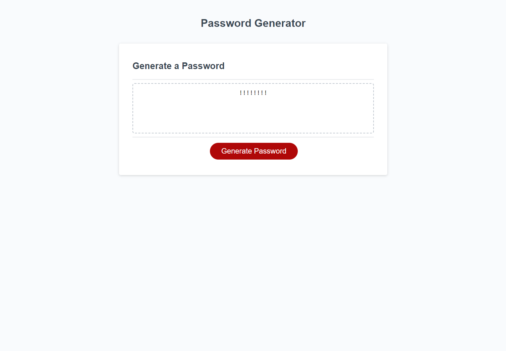

# week-3-challenge-pwgen

## Description

The purpose of this project was to create a working random password generator that pulls random uppercase, lowercase, numbers, and special characters and creates a password of a length specified by the user.

I learned how to: 
<ul>
    <li>Create an arguement with multiple inputs</li>
    <li>work with logic to create conditional arguements for the user input</li>
    <li>to split multiple string elements in to arrays using the string function</li>
    <li>I was unable to get the final step to work because I could not figure out the logic required to get it to combine the math.random and math.floor functions with the given parameters. After hours of research, I couldn't come up with the answer. It will only generate Exclamation points</li> 
</ul>

## Usage

Upon arriving at the webpage, there are prompts that immediately pop up for the user to input the length of password they desire between 8 and 128 characters.

The following popups query the user to select what they wish their password to include, i.e. uppercase, lowercase, numbers, and special characters.

## Credits

[MDN Web Docs](https://developer.mozilla.org/en-US/)
[Stack Overflow](https://stackoverflow.com/questions) 
[Leet Code](https://leetcode.com/problems/is-subsequence/solutions/87354/use-tochararray-instead-of-charat/)
[Programiz](https://www.programiz.com/javascript/examples/generate-random-strings)

## Tests

Enter fields, click generate password. Tested with console and breakpoints but cannot find what my error is.